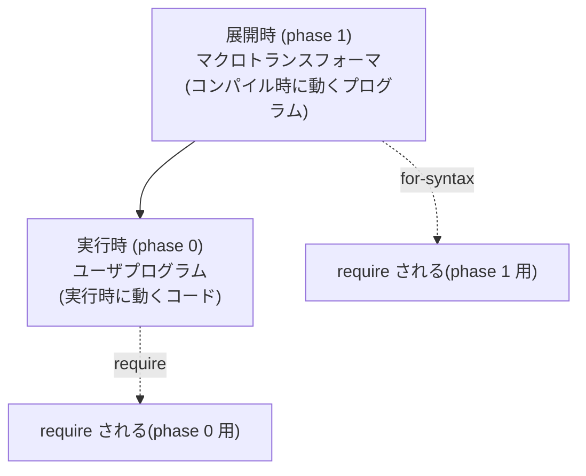

# 第 16 章 マクロ入門

マクロは Racket 最大の武器であり、**これを身に付けるために Lisp を学ぶ** と言ってもいいほどです。しかし初見では理解が難しいので、本章は段階を踏んで紹介します。最初は「コードの形を覚えてもらう」くらいの気持ちで構いません。

## 16.1 なぜマクロなのか

マクロは「**コンパイル時に自分のコードを自分で書き換える**」道具です。他言語のテンプレートや preprocessor と似ていますが、Lisp のマクロには決定的な違いがあります。

- **対象がテキストではなく構文木**。` (if x y z)` を安全に操作できる
- **新しい構文を作れる**(`if`, `let`, `for` のような特殊フォームを自作できる)
- **名前衝突が起きないよう衛生的**(hygienic macros)

つまりマクロは「言語そのものを拡張する」ための機能です。`#lang` の多様さもマクロが支えています。

## 16.2 第一歩 — `define-syntax-rule`

Racket で一番簡単なマクロ構文です。C マクロに近い「パターン → テンプレート」で書けます。

```racket
(define-syntax-rule (swap! a b)
  (let ([tmp a])
    (set! a b)
    (set! b tmp)))
```

```text
> (define x 1)
> (define y 2)
> (swap! x y)
> x
2
> y
1
```

- 左辺 `(swap! a b)` はパターン
- 右辺はテンプレート。`a` / `b` がパターン変数として置き換わる

### 可変長パターン `...`

```racket
(define-syntax-rule (when2 c body ...)
  (if c (begin body ...) (void)))
```

```text
> (when2 #t (displayln "hi") (+ 1 1))
hi
2
```

`...` は「直前のパターンを 0 回以上繰り返す」の意味。テンプレート側にもそのまま書け、同じ繰り返しで展開されます。

これで自作の `when2` マクロが手に入りました。**Racket の `when` はマクロで実装されている** — 標準ライブラリの実装も原理はまさにこれです。

## 16.3 ちょっと本格的: 自作 `for`

```racket
(define-syntax-rule (my-for (i from upto) body ...)
  (let loop ([i from])
    (when (< i upto)
      body ...
      (loop (+ i 1)))))
```

```text
> (my-for (i 0 3) (displayln i))
0
1
2
```

構文としては `(my-for (変数名 開始 終了) 本体 ...)` のように、**自分だけの構文** を生やしています。これは関数では書けません(関数は引数が評価される前に自由に構文を解釈する権限を持たない)。

## 16.4 衛生(hygiene)

自作 `swap!` で `tmp` という名前を使いました。もし呼び出し側にも `tmp` があったらどうなるでしょう。

```racket
(define tmp 999)
(define x 1)
(define y 2)
(swap! x y)
tmp         ; => 999 (影響を受けない!)
```

**名前の衝突が自動で回避されます**。これが「hygienic macros」の hygiene 部分。C マクロだと `do { int tmp = ... } while (0)` のように自分で名前の衝突を気にしないといけませんが、Racket は処理系がやってくれます。

仕組みをざっくり図にすると:


マクロが導入した識別子は **マクロ定義時のスコープ** に属することになるので、呼び出し側の名前とぶつかりません。これだけで安心して使えます。

## 16.5 `syntax-case` — パターンに加えてコードを動かす

`define-syntax-rule` はパターンと展開テンプレートだけです。もっと複雑なマクロでは、**展開時に Racket のコードを走らせたい** ことがあります。そのための道具が `syntax-case`。

```racket
(require (for-syntax racket/base))

(define-syntax (my-if stx)
  (syntax-case stx ()
    [(_ c a b) #'(cond [c a] [else b])]))
```

```text
> (my-if (> 5 3) 'yes 'no)
'yes
```

読み方:

- `stx` には丸ごとの呼び出し構文(構文オブジェクト)が渡される
- `syntax-case` は `stx` をパターン(`(_ c a b)`)にマッチ
- `#'...` は「構文オブジェクト版のクォート」で、テンプレート相当
- `_` はマクロ名自身の位置(ここでは `my-if`)を無視するプレースホルダ

### 展開時コード

`syntax-case` の本体は普通の Racket コードが書けます。たとえば「呼び出し側のコードから引数の個数に応じて違う展開をする」のような処理もできます。

```racket
(define-syntax (my-sum stx)
  (syntax-case stx ()
    [(_) #'0]
    [(_ x) #'x]
    [(_ x y ...) #'(+ x (my-sum y ...))]))
```

この `my-sum` はマクロですが、再帰的に展開されていきます。

```text
> (my-sum)
0
> (my-sum 1 2 3 4)
10
```

## 16.6 `syntax-parse` — よりモダンで宣言的

`syntax/parse` は `syntax-case` の **親切な上位互換** で、構文エラーを自動で整形したり、引数に型注釈(`expr`, `id` など)を付けたりできます。モダン Racket のマクロはほぼこれで書かれます。

```racket
(require (for-syntax racket/base syntax/parse))

(define-syntax (my-for2 stx)
  (syntax-parse stx
    [(_ (i:id from:expr upto:expr) body:expr ...)
     #'(let loop ([i from])
         (when (< i upto)
           body ...
           (loop (+ i 1))))]))
```

各パターン変数の後ろに `:` で続く注釈は **構文クラス(syntax class)** と呼ばれ、「この位置にはこういう形の構文が来るはず」を表す契約です。

- `i:id` — **識別子** でなければエラー。`(my-for2 (42 0 10) ...)` のように数値を置くと弾かれる
- `from:expr` — **式として評価できるもの**(数値リテラル、関数呼び出し、変数参照などすべて OK)
- `body:expr ...` — **式の並び**(ゼロ個以上)

構文クラスには他に `number`(数値リテラル)、`str`(文字列)、`keyword`(キーワード)、ユーザ定義の `define-syntax-class` などが豊富にあります。

**パターンが間違っていると、マクロ側でなくユーザコードの場所に** 丁寧なエラーが出ます。たとえば `(my-for2 (3 0 10) (displayln 3))` と書くと、

```text
my-for2: expected identifier
  at: 3
```

のように、**どのトークンが何として期待されたか** を直接教えてくれます。自作のマクロでも「識別子が来るべきところに数値が来た」程度のエラーはすべて `syntax-parse` が自動で出してくれるので、マクロを書く手間が大幅に減ります。DrRacket で書くとハイライトされる場所も正確。これが Racket マクロの快適さです。

## 16.7 Macro Stepper で覗く

DrRacket には `Macro Stepper` という強力なツールがあり、**マクロが 1 ステップずつどう展開されるか** を可視化できます。次のようなコードで試してみましょう。

```racket
#lang racket
(define-syntax-rule (my-unless c body ...)
  (if c (void) (begin body ...)))

(my-unless (> 1 2)
  (displayln "1 is not greater than 2"))
```

Definitions Window に書いて `Macro Stepper` を起動。`Step` を押すごとに展開が進みます。

1. もとの `(my-unless ...)` の形
2. 展開 1 段後: `(if ... (void) (begin ...))`
3. 標準の `if` まで到達

マクロ展開は自分で追うより処理系に見せてもらう方が絶対に速いです。

## 16.8 `for-syntax` と「相」

マクロを書くときに `(require (for-syntax racket/base))` と書きましたね。これは「**展開時に使う** Racket の機能を読み込む」という意味です。Racket のソースは、実は **時間的に違う 2 つの世界** に属するコードが 1 つのファイルに共存しています。



### なぜ相が分かれているのか

通常の `require` は「実行時に使うライブラリ」を読み込みます。ところが **マクロ本体のコード** は、実行時ではなく **コンパイル時(マクロ展開時)** に走ります。

- `phase 0` = 普通のコード。`(displayln "hi")` を実行する側。
- `phase 1` = マクロを **展開する** 側のコード。`define-syntax` の右辺はここに属する。

2 つの時間軸を区別しないと、たとえば「マクロの展開中に、`string-upcase` を使って識別子名を加工したい」ようなとき、`string-upcase` が phase 0 で定義されているのか phase 1 で呼べるのかが曖昧になってしまいます。

### 具体例で感じる

次のマクロは「識別子の名前から `-count` を付けたカウンタを定義する」というもの。

```racket
#lang racket
(require (for-syntax racket/base racket/syntax))

(define-syntax (define-counter stx)
  (syntax-case stx ()
    [(_ name)
     (with-syntax ([counter-id (format-id #'name "~a-count" #'name)])
       #'(begin
           (define counter-id 0)
           (define (name)
             (set! counter-id (+ counter-id 1))
             counter-id)))]))

(define-counter tick)
(tick) ;; => 1
(tick) ;; => 2
tick-count ;; => 2
```

- `format-id` は `racket/syntax` の関数で、「新しい識別子を作る」ために **展開時に** 呼びます
- だから `(require (for-syntax racket/syntax))` と書いて、phase 1 に `format-id` を取り込んでいる

もし `(require racket/syntax)` だけだと、実行時には使えても **マクロ展開時には使えない** ので、エラーになります。相を正しく分けないとコンパイルが通らない、というのが Racket マクロの厳格な側面です。

### 覚えておきたい `require` 系統

| 書き方 | 意味 |
| --- | --- |
| `(require racket/string)` | phase 0 で使う(普通の実行時コード) |
| `(require (for-syntax racket/base))` | phase 1 で使う(マクロの中身) |
| `(require (for-template racket/base))` | phase 0 へ戻す(マクロが実行時コードを取り込むとき) |
| `(require (for-meta N module))` | 任意の相で使う |

最初は「`define-syntax` の中で関数やデータを使うときは `for-syntax` 必須」くらいに覚えて、必要になったときに公式ドキュメントで他の相を調べれば十分です。相の深掘りは本書の範囲を超えますが、**第二版では 1 章を割いて、`#lang` の自作と合わせて掘り下げる** 予定です。

## 16.9 DSL としてのマクロ

マクロを使うと **小さな DSL** を埋め込みの形で作れます。たとえば「ステートマシンを宣言的に書きたい」なら:

```racket
(define-state-machine traffic
  [red    -> green  on tick]
  [green  -> yellow on tick]
  [yellow -> red    on tick])
```

のような書式を `define-syntax` で作れます。関数として書くより遥かに読みやすく、エラーメッセージもユーザ定義構文の中でちゃんと出ます。

実例としては、Racket 標準の以下のマクロが DSL の鏡のように使えます。

- `for/list`, `for/fold`, `for/hash` — ループ DSL
- `match` — パターンマッチ DSL
- `define-struct/contract` — データ宣言 DSL
- `define-syntax-class`(syntax-parse) — 構文の型定義 DSL
- `scribble/manual` — ドキュメント DSL(これも `#lang`)

これらはどれも Racket で書かれていて、ソースを読めます。**「どうやってこれを作っているのか」** を覗くと、マクロの世界が一気に広がります。

## 16.10 本章のまとめ

- マクロは「コンパイル時にコードを書き換える」道具
- `define-syntax-rule` でパターンとテンプレートを 1:1 で書ける
- `syntax-case` / `syntax-parse` でロジックを持った展開ができる
- 衛生性のおかげで名前衝突を気にせず書ける
- DrRacket の Macro Stepper で展開過程を見られる
- `for-syntax` で相を分けるのが鍵

---

## 手を動かしてみよう

1. `my-and` — 短絡評価の `and` をマクロで実装しなさい。
   ```racket
   (define-syntax my-and
     (syntax-rules ()
       [(_)         #t]
       [(_ e)       e]
       [(_ e1 e2 ...) (if e1 (my-and e2 ...) #f)]))
   ```

2. `unless-let` — 「値を束縛し、それが真ならスキップ、偽なら本体を実行」という構文をマクロで作りなさい。
   ```racket
   (unless-let x (read-line)
     (displayln "no input"))
   ```

3. 第 14 章の mini-lisp に `define-syntax-rule` 相当を追加するのはやや大変ですが、「`cond` は `if` のマクロ展開とみなせる」ことを思い出し、mini-lisp 側で `(cond [(> x 0) 'pos] ...)` を `(if ... ...)` の入れ子に **マクロとして** 書き換える戦略を考察してみてください。これは第 17 章の話にもつながります。

次章では、マクロ以外の **発展トピック** を駆け足で紹介し、次の学びに繋げます。
